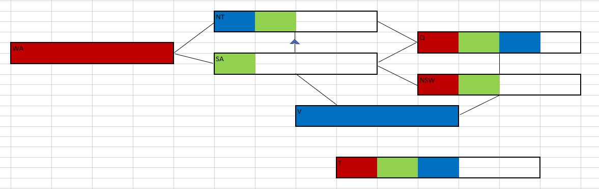
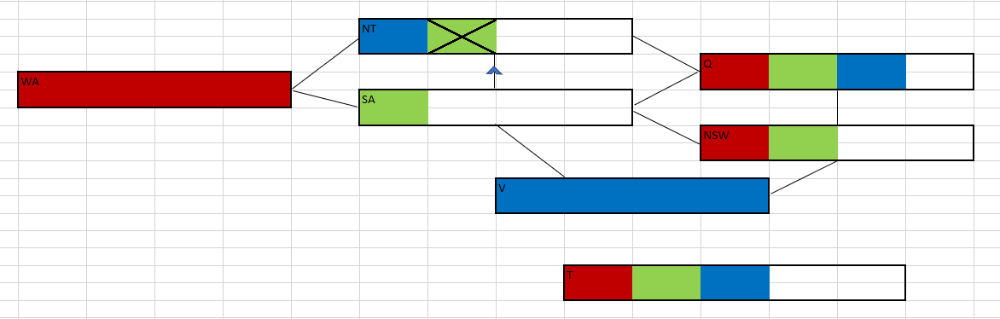
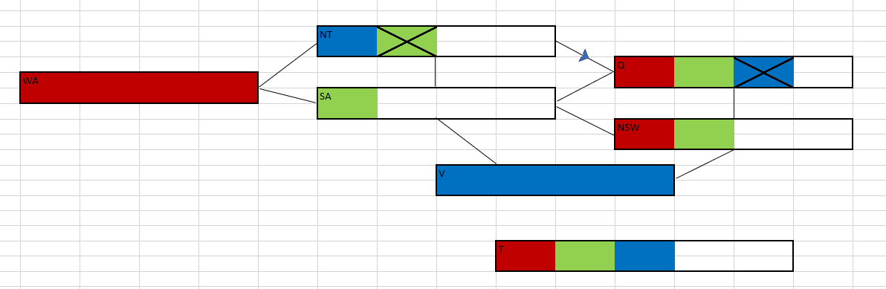
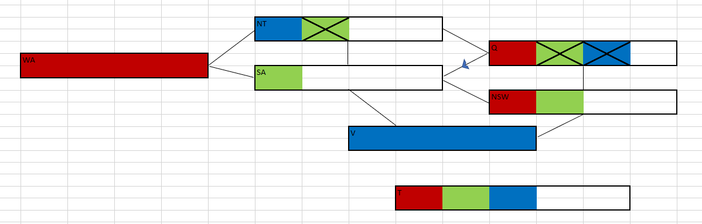
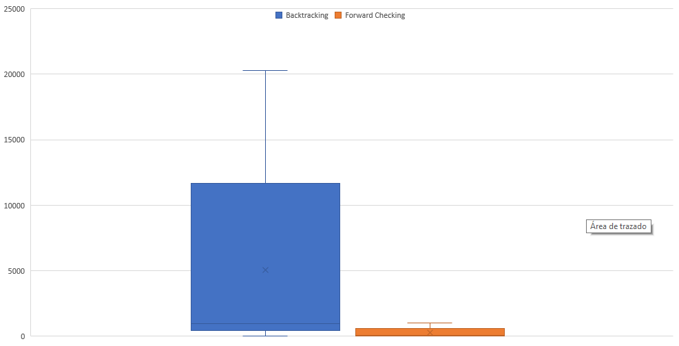
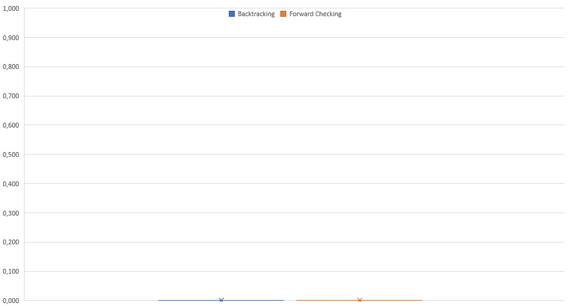

# EJERCICIO 1 

Variables: ***Position_i_j** con 0 < i < 10 y 0 < j < 10*

Dominios: {1, 2, 3, 4, 5, 6, 7, 8, 9}

Restriccion: Variables que se encuentren en la misma fila, columna o sub-cuadrado no pueden tener el mismo valor. 

Ej: *Position_i_j != Position_k_j*

 

# EJERCICIO 2

Comenzando con la asignación parcial dada en el enunciado, el estado inicial es el siguiente:

Si comenzamos viendo la arco-consistencia de SA con respecto a NT notamos que es incosistente, lo cual se puede corregir eliminando el color ***Verde*** de NT:

Al haber eliminado un elemento del dominio de NT, debemos revisar los vecinos. Como con WA y SA se cumple la consistencia, solo analizamos a Q y vemos que no se cumple la arco-consistencia, entonces se elimina el color ***Azul*** de Q:

Siguiendo el algoritmo es el momento de analizar los vecinos de Q (NT, SA y NSW). Hay consistencia con NT, con SA hay inconsistencia que se soluciona eliminando el color ***Verde*** de Q:

Para finalizar queda NSW, el cual no puede tomar los valores que tenía inicialmente ya que Q tendría una asignación parcial ***Roja*** y SA una ***Verde***.

Q.E.D.

 

# EJERCICIO 3 

La complejidad en el peor caso es de $O(n * d)$ siendo $n$ la cantidad de aristas del arbol y $d$ la cantidad de elementos pertenecientes al dominio de cada variable.

 

4. AC-3 coloca de nuevo en la cola todo arco $(x_k, x_i)$ cuando cualquier valor es removido del dominio de $x_i$ incluso si cada valor de $x_k$ es consistente con los valores restantes de $x_i$. Si por cada arco $(x_k,x_i)$ se lleva cuenta del número de valores que quedan de $x_i$ que sean consistentes con $x_k$. Explicar como actualizar ese número de manera eficiente y demostrar que la arco consistencia puede lograrse en un tiempo total O($n^2d^2$).

Se puede crear una estructura que contenga 2 diccionarios. 1 donde se guarden todas las aristas $X_i$ y sus relaciones $X_k$ + la variable a la que pertenece y otro donde se guarden las variable vecinas y el número de relaciones que posee.
Al encontrar una arista $(X_i, X_k)$ se elimina la relación del primer diccionario y se disminuye en 1 el valor del atributo correspondiente a la variable eliminada en el segundo diccionario. Solo es cuestion de acceder al valor que se guarda en el segundo diccionario para saber cuantos valores quedan de $X_i$ que sean consistentes con $X_k$.

 

# EJERCICIO 5 

1) Teniendo en cuenta que el algoritmo CSP para árboles estructurados tiene los siguientes pasos:

1. Generar un árbol con las variables ordenados de manera tal que el padre de cada una en el árbol lo precede en el ordenamiento.

2. Aplicamos arco consistencia a la inversa. Lo que elimina valores inconsistentes del dominio .

3. Asignamos los valores del dominio a cada variable.

Inicialmente generamos el arbol de dicha manera para obtener que cada variable se relacione con una sola (el padre) con la cual se debe cumplir la arco-consistencia. Es decir, nunca caeremos en el caso de de resolver una k-consistencia.
Luego al pasar a 3 se asignan los valores sin vuelta atrás ya que los nodos son arco-consistentes por 2.
Así, se cumple la k-consistencia.

2) Cuando el grafo de restricciones sea se puede convertir en un arbol, podemos decir que el algoritmo es correcto y k-consistente, por lo tanto es lo demostrado en 1) es suficiente.

 

# EJERCICIO 6

Tamaño de los tableros: [4, 8, 10, 12, 15]

## Backtracking

States: [26, 876, 975, 3066, 20280]

Times: [0.0, 0.0, 0.00103, 0.00103, 0.05404] 

## Forward Checking

States: [8, 88, 83, 193, 1026]

Times: [0.0, 0.00619, 0.005, 0.00804, 0.03642]

## Grafico de cajas de los estados

## Grafico de cajas de los tiempos
