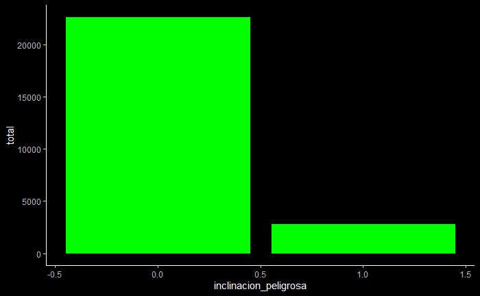
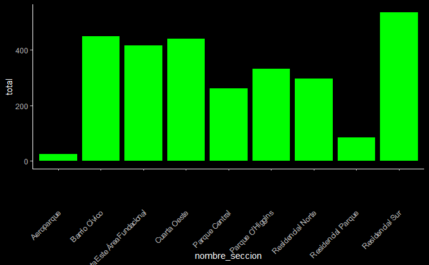
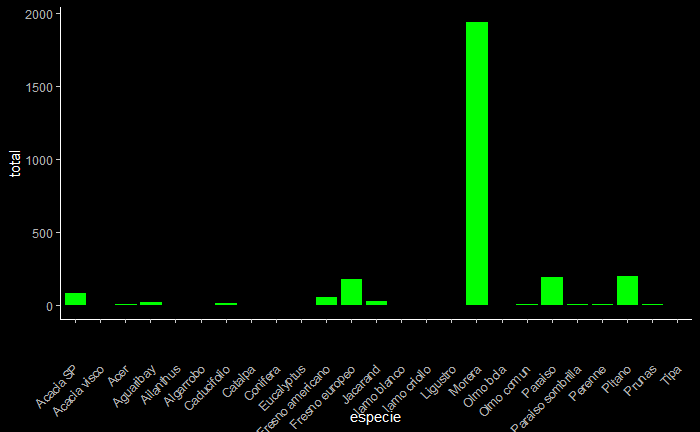
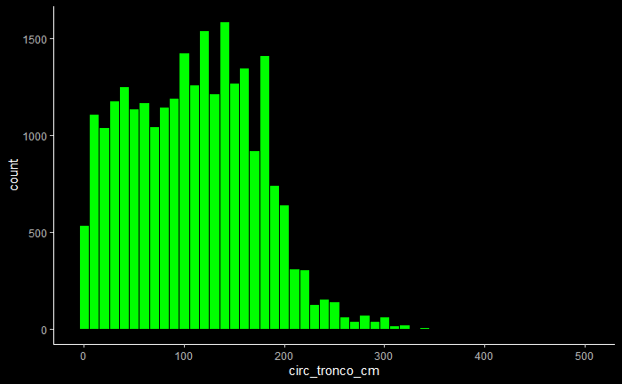
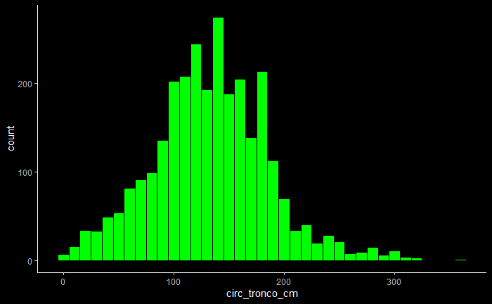

# PARTE A

## EJERCICIO 2.A
La distribución de la clase se observa a continuación. Siendo 0.0 árboles sin inclinación peligrosa y 1.0 árboles con inclinación peligrosa.

 

## EJERCICIO 2.B
Si, se puede considerar, por ejemplo, que las regiones como *"Residencial sur"*, *"Barrio óvico"* son mucho más peligrosas que *"Aeroparque"*.

 

## EJERCICIO 2.B
Si, resalta que la especie *"Morera"* es de las más peligrosas.

 

## EJERCICIO 3.B

 

## EJERCICIO 3.C

 

## EJERCICIO 3.D

 

Para utilizar el corte se calcularon los cuartiles con:

    *quantile(train$circ_tronco_cm)*

Que en este caso dieron:

    0%   25%   50%   75%  100% 

    0.1  58.0 110.0 157.0 500.0 

Entonces, se clasificaron de la siguiente manera:
- Los que tienen una circunferencia menor a 58 se clasificaron como bajos.
- Los que tienen una circunferencia entre 58 y 110 se clasificaron como medio.
- Los que tienen una circunferencia entre 110 y 157 se clasificaron como alto.
- Los que tienen una circunferencia más de 157 se clasificaron como muy altos.

