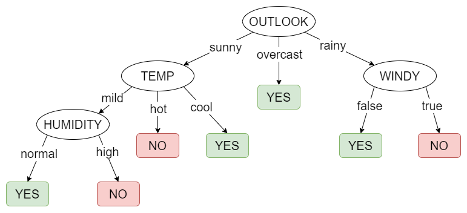

# RESULTADOS ÁRBOL DE DECISIÓN

# ÁRBOLES DE DECISIÓN PARA DATOS DE TIPO REAL

Cuando se trabajan con arboles de decisión en los cuales alguno de los atributos involucrados se divide en valores continuos (por lo general números reales) se deben tratar como **Árboles de regresión**

En los árboles de regresión, se clasifican los atributos continuos en  discretos seleccionando uno o n puntos de corte dentro del intervalo de la variable. De esta forma los posibles valores del atributo continuo quedan divididos en *n* subintervalos.

Existen diversos métodos para realizar esta división dinámicamente, pero esta parte es la más ineficiente del desarrollo de árboles de desición ya que en la mayoria de los casos se debe dividir el rango de la variable en n subintervalos y seleccionar el o los puntos de corte que nos generen una mayor ganancia. Algunos métodos para seleccionar los posibles puntos de corte son los siguintes:

1. Dividir el rango de la variable en n subintervalos del mismo tamaño.
2. Utilizar los valores posibles de la variable.
3. Seleccionar n valores aleatoriamente que se encuentren dentro del intervalo.

Aunque esta forma de discretizar la variable requiera un preprocesado mayor, en la práctica resulta conveniente ya que ayuda mucho al momento de tomar las decisiones. Además que al seleccionar el atributo en una primera instancia, puede seleccionarse nuevamente en un nivel más bajo del arbol, esta vez con un punto de corte dentro de un intervalo mucho más pequeño y preciso (dependiendo la cantidad de puntos de corte que se hayan seleccionado previamente).

